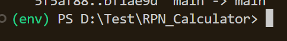
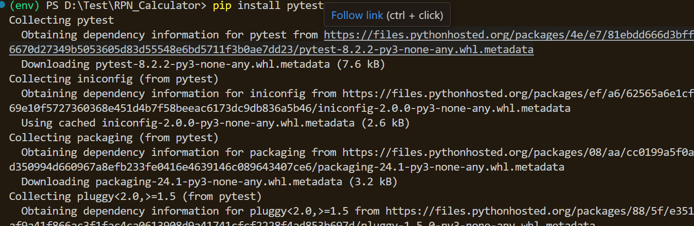
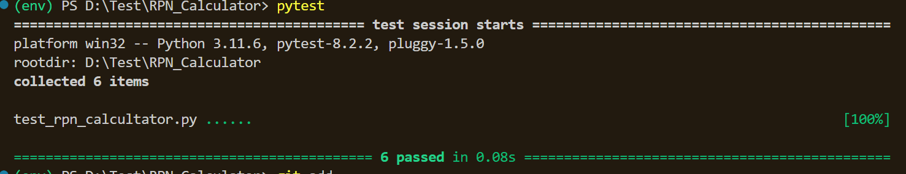
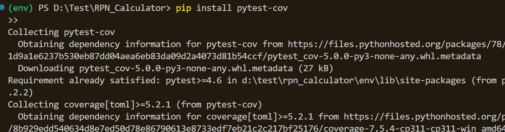
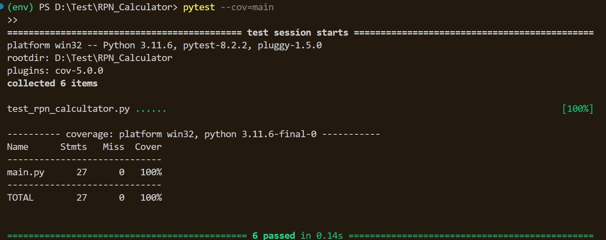

# RPN Calculator in Python

## Description
This RPN Calculator implements the Reverse Polish Notation (RPN) in Python to perform arithmetic operations. RPN, also known as postfix notation, places operators after their operands, eliminating the need for parentheses to govern operation precedence.

## Features
- **Basic Arithmetic:** Supports operations like addition (`+`), subtraction (`-`), and multiplication (`*`).
- **Error Handling:** Includes input validation for non-numeric characters and checks for insufficient operands.
- **Extensible:** Designed to be easily extended to include additional operations.

## Getting Started

### Prerequisites
Make sure you have Python 3.x installed on your system. You can check your Python version by running:

```bash
python --version or python3 --version
```
### Create virtual environment 
Make sure to create virtual environment to install all dependecies or package in this environment.
```` bash
python -m venv env(name of virtual environnment) (On only windows Os)
````
After you can turn on your environnment:
```` bash
env\Scripts\activate (On only windows Os)
````
[image virtual env][]

### Installation
Clone the repository to your local machine:

````bash
Copy this code 
git clone https://github.com/alfred-saker/Rpn_calcultor_python.git
cd Rpn_calcultor_python
````
### Running the Calculator
Execute the script from the command line:

````bash
Copy this code
python rpn_calculator.py
````
### Usage
To calculate an expression like (3 + 4) * 5 in RPN format, input:

```` bash
Copy this code
python rpn_calculator.py "3 4 + 5 *"

````

The output will be:
````bash
Result: 35
````

### Running unit Tests
To run tests, first install pytest if it's not already installed:

````bash
Copy this code
pip install pytest
````


After installation, check the installed modules with
````bash
pip list or pip freeze
````

Then, execute the units tests with:

````bash
Copy this code
pytest
````
result of test:


### Running the coverage tests
To run coverage tests, first install pytest-cov if it's not already installed:

````bash
Copy this code
pip install pytest-cov
````

After installation, check the installed modules with
````bash
pip list or pip freeze
````

Then, execute the coverage tests with:

````bash
Copy this code
pytest --cov=my_module (my_module=main)
````
result of test:


### Create a requirements file
To facilitate future usage and setups, create a **requirements.txt** file that lists all dependencies. Run the following command:
````bash
pip freeze > requirements.txt
````

### Contributing
Contributions are welcome! Please follow these steps to contribute:

* Fork the repository.
* install all package required with
```` bash
pip install requirements.txt
````
* Create a new branch for each feature or improvement.
* Submit a pull request from each feature branch to the main branch for review.

### License
This project is licensed under the MIT License - see the LICENSE file for details.

### Authors
**Alfred KUATE.K** - AK - [YourGitHubProfile](https://github.com/alfred-saker/)
**Acknowledgments**
**Thanks to everyone who has contributed to this project**.
**Inspired by the classic RPN calculators of the past.**


